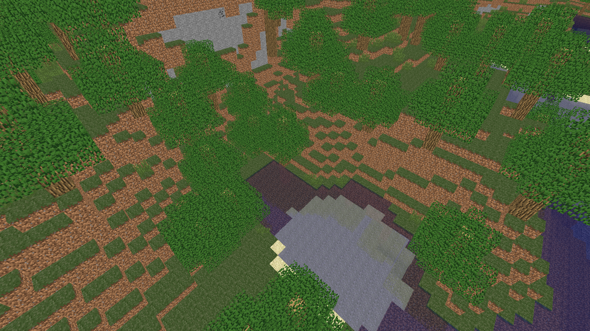

# Examples

Bukkit Screenshot lets you render your images using several pre-established resolutions and aspect ratios.

##Base image

For this example, the following image will be used as base. Different resolutions will be used, along with the 16:9 aspect ratio.

##Generated images

As a form of comparison, the image below represents the 1080P equivalent of the base image, generated by Bukkit Screenshot. The pictures for the other resolutions can be found along with it.

